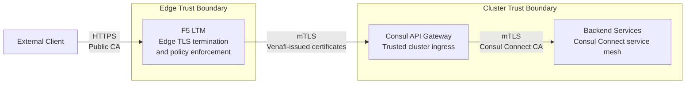

# F5 LTM to Consul API Gateway mTLS Configuration

This repository provides reference configuration, automation, and operator guidance for implementing end-to-end mutual TLS (mTLS) between F5 LTM and Consul API Gateway on OpenShift using Venafi-issued certificates.

It is intended for platform teams that need to secure north-south traffic at the edge, enforce authenticated ingress into the cluster, and preserve Consul Connect mTLS for service-to-service communication deeper in the environment.

## Architecture Overview



From an operator point of view, this architecture separates trust domains while maintaining a secure request path end to end:

- **External TLS terminates at F5** using the certificate, policies, and controls appropriate for internet-facing traffic.
- **F5 re-encrypts traffic to Consul API Gateway with mTLS** so both sides authenticate each other before traffic enters the cluster.
- **Consul API Gateway acts as the trusted ingress boundary** for cluster traffic and hands requests into the mesh.
- **Backend services continue to rely on Consul Connect mTLS** for east-west security inside the platform.

This separation lets operators manage edge certificates, gateway trust, and mesh identity independently without collapsing them into a single PKI boundary.

## Key Principles

These principles shape the configuration in this repository:

1. **Terminate and re-encrypt**  
   F5 handles external TLS, then establishes a new mutually authenticated TLS session to the API Gateway.

2. **Use separate PKI hierarchies**  
   Venafi is used for the F5-to-gateway trust relationship, while Consul CA continues to manage service mesh identity.

3. **Require mutual authentication**  
   F5 validates the gateway certificate, and the gateway validates the F5 client certificate.

4. **Design for rotation**  
   Certificates should be short-lived, centrally managed, and renewable with minimal operational disruption.

## Repository Structure

The repository is organized around the operator workflow of issuing certificates, configuring the edge, deploying the gateway, and validating the result.

```
.
├── README.md                          # Overview and quickstart
├── docs/                              # Supporting documentation
│   ├── architecture.md                # Detailed architecture guidance
│   ├── best-practices.md              # Security and operational guidance
│   ├── troubleshooting.md             # Common issues and fixes
│   └── certificate-rotation.md        # Certificate lifecycle guidance
├── venafi/                            # Venafi certificate policies and automation
│   ├── policies/                      # Certificate policy definitions
│   ├── scripts/                       # Certificate request and renewal scripts
│   └── examples/                      # Example request payloads and usage
├── f5/                                # F5 LTM configuration artifacts
│   ├── ssl-profiles/                  # Client and server SSL profiles
│   ├── virtual-servers/               # Virtual server definitions
│   ├── pools/                         # Backend pool configuration
│   └── scripts/                       # F5 automation scripts
├── consul-gateway/                    # Consul API Gateway manifests
│   ├── gateway.yaml                   # Gateway configuration
│   ├── gateway-class.yaml             # GatewayClass definition
│   ├── routes/                        # HTTPRoute definitions
│   └── intentions/                    # Service intentions
├── kubernetes/                        # Supporting Kubernetes/OpenShift resources
│   ├── secrets/                       # Secret templates
│   ├── configmaps/                    # ConfigMap templates
│   ├── network-policies/              # Network policy definitions
│   ├── services/                      # Service definitions
│   └── deployments/                   # Deployment manifests
├── monitoring/                        # Monitoring and alerting assets
│   ├── prometheus/                    # Prometheus rules and queries
│   ├── grafana/                       # Grafana dashboards
│   └── alerts/                        # Alert definitions
├── scripts/                           # End-to-end automation helpers
│   ├── deploy.sh                      # Deploy gateway-side resources
│   ├── verify.sh                      # Validate the deployment
│   ├── rotate-certs.sh                # Rotate certificates
│   └── troubleshoot.sh                # Troubleshooting helper
└── examples/                          # End-to-end examples
    ├── basic/                         # Minimal working setup
    ├── production/                    # Production-oriented example
    └── testing/                       # Validation and test scenarios
```

## Quick Start

This quickstart walks through how to stand up a secure ingress path from F5 LTM to Consul API Gateway using mutual TLS. 

By the end of this process, you will have:

- requested and generated the certificates needed for mutual authentication,
- configured F5 to terminate external TLS and re-establish trust upstream,
- deployed Consul API Gateway with the required certificates and trust bundles, and
- verified that traffic is flowing securely from the edge into the mesh.

### Prerequisites

Before you begin, make sure you have access to all systems involved in the trust chain:

- F5 LTM with admin access
- OpenShift cluster with Consul deployed
- Venafi TPP or Cloud instance
- `kubectl` and `oc` CLI tools
- `vcert` CLI tool
- `tmsh` access to F5

It is also helpful to clone the repository locally so you can run the scripts directly:

```bash
git clone https://github.com/chris-lovett/API-Gateway-mTLS.git
cd API-Gateway-mTLS
```

### 1. Issue certificates from Venafi

The first step is to establish identity on both sides of the F5-to-gateway connection.

At this stage, you are creating:
- a **server certificate** for the Consul API Gateway, so F5 can verify the gateway it connects to, and
- a **client certificate** for F5, so the gateway can require F5 to authenticate with a trusted certificate.

This is the foundation for mutual TLS between the load balancer and the gateway.

Run:

```bash
cd venafi/scripts
./request-gateway-cert.sh
./request-f5-client-cert.sh
cd ../..
```

When this step is complete, you should have the certificate artifacts needed to configure both the gateway and F5.

### 2. Configure F5 LTM as the secure edge and upstream mTLS client

Next, configure F5 so it can accept external HTTPS traffic and then re-encrypt upstream traffic to Consul API Gateway using mTLS.

Operationally, this step:
- uploads the relevant certificates and keys to F5,
- configures the SSL profiles that define how inbound and outbound TLS are handled, and
- creates the virtual server and pool that forward traffic to the gateway.

In other words, F5 becomes the edge entry point for clients and the authenticated client of the API Gateway.

Run:

```bash
cd f5/scripts
./upload-certs.sh
./configure-f5.sh
cd ../..
```

After this step, F5 should be prepared to initiate a mutually authenticated TLS session to the gateway.

### 3. Deploy Consul API Gateway with the required trust material

With F5 ready, the next step is to configure the cluster-side ingress components.

From an operator’s perspective, this step:
- creates Kubernetes secrets and related configuration for the gateway certificate and CA material,
- deploys the Consul API Gateway resources, and
- enables the gateway to validate incoming client certificates rather than accepting anonymous upstream connections.

This is where the cluster becomes ready to trust only approved upstream clients such as F5.

Run:

```bash
cd scripts
./deploy.sh
cd ..
```

After deployment, the gateway should be present in the cluster and configured to participate in the intended trust model.

### 4. Verify the end-to-end configuration

The final step is to confirm that the secure ingress path is actually working as designed.

This verification step should validate that:
- the certificates were issued and installed correctly,
- F5 can successfully establish mTLS to the API Gateway,
- the gateway requires and validates client certificates, and
- requests can continue onward to backend services through Consul.

Run:

```bash
cd scripts
./verify.sh
cd ..
```

At the end of this step, you should have confidence that the deployment is not only present, but correctly enforcing trust across the ingress path.

## Configuration Files

The following files are the main building blocks for the reference implementation. They are grouped by the operational concern they support.

### Venafi certificate assets

These files define how certificates are requested and managed for the F5-to-gateway trust relationship:

- [`venafi/policies/gateway-server-policy.json`](venafi/policies/gateway-server-policy.json) - Policy used to issue the API Gateway server certificate
- [`venafi/policies/f5-client-policy.json`](venafi/policies/f5-client-policy.json) - Policy used to issue the F5 client certificate
- [`venafi/scripts/request-gateway-cert.sh`](venafi/scripts/request-gateway-cert.sh) - Script that requests the gateway certificate
- [`venafi/scripts/request-f5-client-cert.sh`](venafi/scripts/request-f5-client-cert.sh) - Script that requests the F5 client certificate

### F5 configuration assets

These files define how F5 handles external TLS, upstream mTLS, and traffic forwarding:

- [`f5/ssl-profiles/client-ssl-profile.tmsh`](f5/ssl-profiles/client-ssl-profile.tmsh) - SSL profile for client-facing traffic
- [`f5/ssl-profiles/server-ssl-profile.tmsh`](f5/ssl-profiles/server-ssl-profile.tmsh) - SSL profile for upstream mTLS to the gateway
- [`f5/virtual-servers/api-gateway-vs.tmsh`](f5/virtual-servers/api-gateway-vs.tmsh) - Virtual server definition for ingress traffic
- [`f5/pools/api-gateway-pool.tmsh`](f5/pools/api-gateway-pool.tmsh) - Pool definition for forwarding traffic to the gateway

### Consul API Gateway assets

These manifests define the gateway resources that receive and route traffic inside the cluster:

- [`consul-gateway/gateway.yaml`](consul-gateway/gateway.yaml) - Gateway definition with client certificate validation
- [`consul-gateway/gateway-class.yaml`](consul-gateway/gateway-class.yaml) - GatewayClass configuration
- [`consul-gateway/routes/backend-route.yaml`](consul-gateway/routes/backend-route.yaml) - Example route to a backend service
- [`consul-gateway/intentions/gateway-to-backend.yaml`](consul-gateway/intentions/gateway-to-backend.yaml) - Service intention controlling gateway-to-backend access

### Kubernetes and OpenShift assets

These resources support certificate distribution, service exposure, and network controls around the gateway:

- [`kubernetes/secrets/gateway-tls-secret.yaml`](kubernetes/secrets/gateway-tls-secret.yaml) - Template for the gateway TLS secret
- [`kubernetes/configmaps/venafi-ca-bundle.yaml`](kubernetes/configmaps/venafi-ca-bundle.yaml) - ConfigMap containing the Venafi CA bundle
- [`kubernetes/network-policies/gateway-ingress.yaml`](kubernetes/network-policies/gateway-ingress.yaml) - NetworkPolicy restricting ingress to approved F5 sources
- [`kubernetes/services/gateway-service.yaml`](kubernetes/services/gateway-service.yaml) - Service definition exposing the gateway

## Security Best Practices

This repository assumes that operators want strong trust boundaries, minimal blast radius, and manageable certificate operations.

1. **Use separate PKI hierarchies**
   - Use Venafi for the F5 ↔ API Gateway connection
   - Use Consul CA for service mesh identity
   - Avoid reusing the same trust anchor for both ingress and mesh traffic

2. **Restrict trust boundaries**
   - Prefer a dedicated Venafi intermediate CA for this integration
   - Avoid trusting a broad enterprise root bundle when a narrower trust scope is sufficient

3. **Use short-lived certificates**
   - Target 30-90 day validity periods where practical
   - Reduce long-lived credential exposure
   - Pair shorter lifetimes with an operational rotation process

4. **Enforce strict validation**
   - Require client certificates on the gateway-facing connection
   - Validate SANs, subjects, and chain of trust
   - Enable hostname verification where supported

5. **Segment network access**
   - Use NetworkPolicies to limit which source addresses can reach the gateway
   - Restrict exposure to the minimum set of trusted ingress sources

## Certificate Lifecycle

A secure deployment is not just about initial issuance. Operators also need a predictable lifecycle for renewal, rollout, and monitoring.

### Issuance

During initial setup, the certificate flow typically looks like this:

1. Request certificates from Venafi using the appropriate policies
2. Store the gateway certificate in Kubernetes and the client certificate on F5
3. Apply or update the relevant gateway and F5 configuration

### Rotation

For ongoing operations, plan for rotation from the beginning:

1. Automate gateway-side renewal where possible using Venafi-integrated workflows
2. Use a scheduled or documented operational process for F5 certificate replacement
3. Rotate certificates in a way that avoids unnecessary downtime or trust gaps

### Monitoring

Operators should monitor both certificate health and connection behavior:

- Alert on certificate expiration before the renewal window closes, such as 15 days out
- Monitor TLS handshake failures for early signs of trust or configuration problems
- Expose metrics into Prometheus and dashboards for operational visibility

## Troubleshooting

When this pattern fails, the most common causes are networking, certificate trust, or client authentication settings.

### Connection refused

A refused connection usually indicates the traffic path is not open or the gateway is not reachable.

Checks to perform:
- Confirm the NetworkPolicy allows traffic from the F5 source IP range
- Verify the gateway Service is exposed on the expected port
- Test basic connectivity to the gateway endpoint with `telnet gateway-ip 443`

### TLS handshake failure

A handshake failure typically means one side does not trust the certificate presented by the other, or the certificate identity is incorrect.

Checks to perform:
- Verify certificate validity dates: `openssl x509 -in cert.crt -noout -dates`
- Validate the certificate chain: `openssl verify -CAfile ca.crt cert.crt`
- Confirm SAN values and expected identity: `openssl x509 -in cert.crt -noout -text | grep DNS`

### Client certificate not required

If a connection succeeds when it should require mTLS, the gateway is likely not enforcing client authentication correctly.

Checks to perform:
- Verify the gateway configuration includes `require_client_certificate: true`
- Confirm the Venafi CA bundle is mounted and referenced correctly
- Test the connection without presenting a client certificate; it should fail

For deeper investigation, see [`docs/troubleshooting.md`](docs/troubleshooting.md).

## Monitoring

Operators should treat certificate health and TLS behavior as first-class platform signals.

### Prometheus metrics

These example queries can help track expiration risk, handshake failures, and encrypted connection volume:

```promql
# Certificate expiration
(x509_cert_not_after{secret_name="api-gateway-tls"} - time()) / 86400

# TLS handshake failures
rate(envoy_ssl_connection_error{namespace="consul"}[5m])

# mTLS connections
envoy_cluster_ssl_connection_total{cluster_name="local_app"}
```

### Grafana dashboards

The repository also includes example dashboards for day-two visibility:

- [`monitoring/grafana/mtls-overview.json`](monitoring/grafana/mtls-overview.json) - Dashboard for overall mTLS health and behavior
- [`monitoring/grafana/certificate-expiration.json`](monitoring/grafana/certificate-expiration.json) - Dashboard focused on certificate age and expiration windows

## Examples

The examples directory provides starting points for different levels of operational maturity.

### Basic setup

See [`examples/basic/`](examples/basic/) for a minimal working configuration that demonstrates the core F5-to-gateway mTLS flow.

### Production setup

See [`examples/production/`](examples/production/) for a more production-oriented configuration, including:
- high availability,
- automated certificate rotation,
- broader monitoring coverage, and
- stricter network controls.

### Testing

See [`examples/testing/`](examples/testing/) for validation scenarios and supporting scripts you can use during rollout and troubleshooting.

## Contributing

Contributions are welcome. If you want to improve the reference implementation:

1. Fork the repository
2. Create a feature branch
3. Make your changes
4. Test thoroughly
5. Submit a pull request

## Support

If you run into problems or want to understand the design in more depth:

1. Review [`docs/troubleshooting.md`](docs/troubleshooting.md)
2. Review [`docs/best-practices.md`](docs/best-practices.md)
3. Open an issue in this repository

## License

[Your License Here]

## References

- [Consul API Gateway Documentation](https://developer.hashicorp.com/consul/docs/api-gateway)
- [Venafi Documentation](https://docs.venafi.com/)
- [F5 LTM SSL Profiles](https://techdocs.f5.com/en-us/bigip-15-0-0/big-ip-local-traffic-manager-profiles-reference/ssl-profile.html)
- [Kubernetes Gateway API](https://gateway-api.sigs.k8s.io/)
