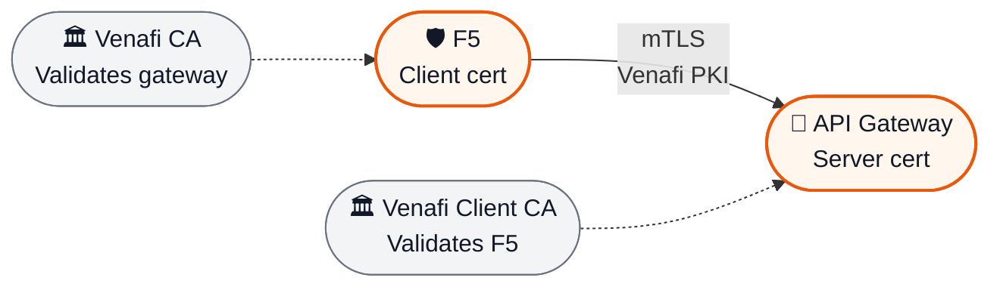
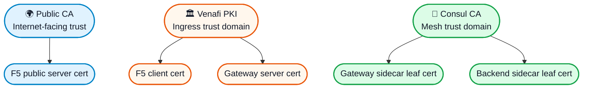
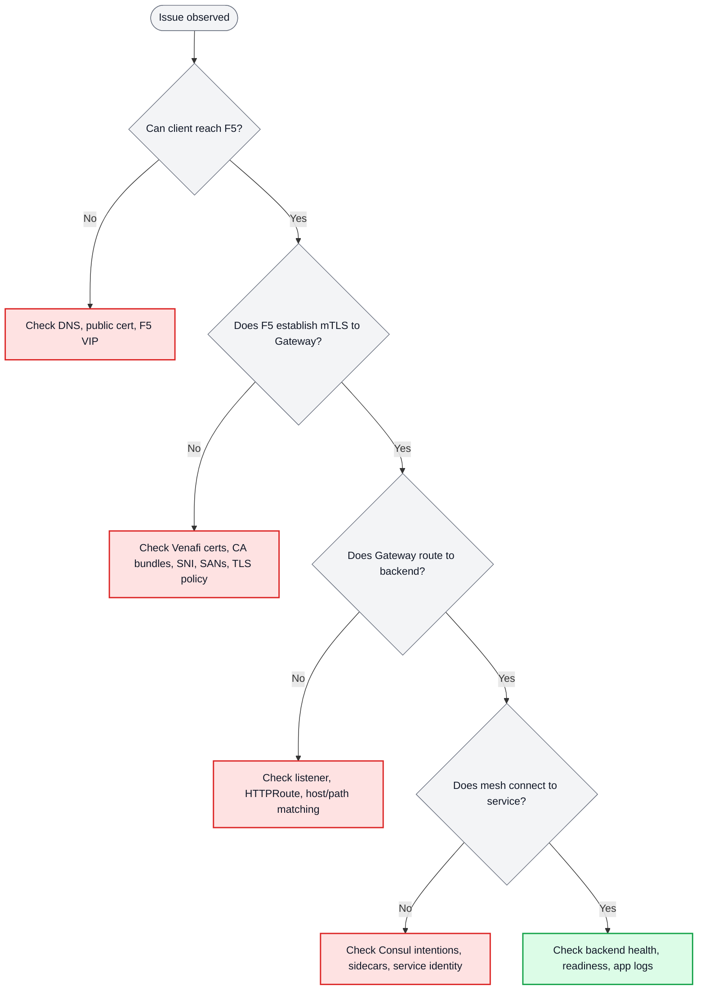

# Architecture Deep Dive: Deployment, Flow, and Trust Boundaries

## Purpose

This document is the operator-focused deep dive for the API Gateway mTLS deployment in this repository.

If you want a shorter conceptual introduction, see [architecture.md](./architecture.md).

## Scope

This document focuses on:

- the deployed Kubernetes and Consul resources represented in this repository
- how traffic flows from F5 into the cluster
- where TLS is terminated or enforced
- how routing and authorization are applied
- where operators should look when failures occur

## End-to-End Conceptual Flow

## Kubernetes Deployment View

This view shows the major Kubernetes and Consul resources represented in the repository and how they relate to the external F5 and the backend service.

## How to Read the Deployment View

- **F5** is outside the cluster and connects to the gateway service using **mTLS**.
- The **`consul` namespace** contains the gateway control and ingress resources.
- The **`default` namespace** contains the route, authorization, and application resources.
- **Consul Connect** secures the gateway-to-backend path inside the cluster.
- **NetworkPolicy** and **ServiceIntentions** are separate controls:
  - `NetworkPolicy` constrains network reachability
  - `ServiceIntentions` constrains service-to-service authorization in the mesh

## Resource Relationship Summary

| Resource | Role | Relationship |
|---|---|---|
| `GatewayClass` | Declares Consul as the Gateway API controller | Referenced by `Gateway` |
| `GatewayClassConfig` | Configures gateway deployment and service behavior | Attached to `GatewayClass` |
| `Gateway` | Defines listeners and ingress TLS behavior | Front door inside Kubernetes |
| `api-gateway` `Service` | Exposes gateway listeners on 80/443 | Target for F5 traffic |
| `api-gateway-tls` / `venafi-f5-client-ca` | Server certificate and trusted client CA material | Used by gateway TLS validation |
| `HTTPRoute` | Maps host/path traffic to backend services | Attached to `Gateway` |
| `ServiceIntentions` | Authorizes gateway-to-backend communication | Applied in the mesh |
| `backend-service` `Service` | Stable endpoint for backend pods | Target selected by route |
| `backend` `Deployment` | Runs the application workload | Backed by sidecar-enabled pods |
| `ServiceAccount` | Workload identity context | Used by deployment |
| `HPA` | Scales the deployment | Targets backend workload |
| `PDB` | Protects service availability during disruption | Applies to backend pods |
| `NetworkPolicy` | Restricts allowed traffic paths | Protects gateway and backend workloads |

## Full Request Flow

### Step 1: External client reaches F5

A client connects to the public API endpoint over HTTPS.

At this boundary:

- F5 presents the public-facing certificate
- public TLS is terminated
- edge controls such as inspection, WAF, or rate limiting may be applied

### Step 2: F5 establishes mTLS to the API Gateway

F5 becomes the TLS client for the next hop and opens a new connection to the gateway service.

At this boundary:

- F5 presents a **Venafi-issued client certificate**
- the API Gateway presents a **Venafi-issued server certificate**
- each side validates the other against trusted CA material
- this is the primary authenticated ingress boundary into the cluster-hosted gateway layer

### Step 3: API Gateway evaluates listener and route rules

Once the request is accepted:

- the gateway listener accepts the connection
- client certificate validation has already succeeded
- routing rules determine which backend service should receive the request
- host, path, header, and other route logic may apply

### Step 4: Gateway forwards into the mesh

The gateway uses the service mesh path to reach the backend.

At this boundary:

- gateway-side and backend-side proxies establish **Consul Connect mTLS**
- service identity and authorization apply
- `ServiceIntentions` determine whether the communication is allowed

### Step 5: Backend sidecar forwards to the app

The backend sidecar forwards traffic to the local application container.

At this point:

- the application typically receives **plain HTTP**
- the application does not directly manage public ingress certificates
- the application remains decoupled from external trust establishment details

### Step 6: Response returns through the same layers

The response returns in reverse:

- app → backend sidecar
- backend sidecar → gateway sidecar over mesh mTLS
- gateway → F5
- F5 → external client

## Step-by-Step Reference Table

| Step | From | To | Protocol | Identity / Certificate | What Happens |
|---|---|---|---|---|---|
| 1 | Client | F5 | HTTPS | Public CA | Client initiates secure connection |
| 2 | F5 inbound | F5 processing | TLS terminated | Public server certificate on F5 | Edge inspection and policy enforcement |
| 3 | F5 outbound | API Gateway service | mTLS | F5 client cert + Gateway server cert | Mutual authentication is enforced |
| 4 | API Gateway | Route engine | HTTPS request context | Gateway listener and route policy | Request is matched to backend destination |
| 5 | Gateway sidecar | Backend sidecar | mTLS | Consul workload identities | Internal service-to-service security |
| 6 | Backend sidecar | App container | HTTP | localhost only | Application receives request |
| 7 | App | Return path | Reverse of above | Same layered trust boundaries | Response flows back to caller |

## Trust Boundaries

| Boundary | Connection | TLS Mode | Trust Source | Purpose |
|---|---|---|---|---|
| 1 | External Client → F5 | HTTPS | Public CA | Secure public ingress |
| 2 | F5 → API Gateway | mTLS | Venafi PKI | Authenticated north-south traffic |
| 3 | API Gateway → Backend | mTLS | Consul CA | Service-to-service encryption |

> [!IMPORTANT]
> The primary security boundary is **F5 → API Gateway**. That is where mutual authentication is enforced for ingress into the platform.

## Layer-by-Layer Deep Dive

### 1. Edge Ingress Layer

Key points:

- External clients connect over standard HTTPS.
- F5 terminates public TLS.
- F5 can enforce edge policy before traffic enters the platform.
- This layer is the public entry point, but not the primary mutual-authentication boundary.

### 2. Ingress mTLS Boundary

Key points:

- F5 acts as the TLS client.
- The API Gateway acts as the TLS server on this boundary.
- The gateway validates the F5 client certificate.
- F5 validates the gateway server certificate.
- Hostname verification and SNI should remain enabled where supported.

### 3. Internal Mesh Layer

Key points:

- Internal service-to-service traffic uses **Consul Connect mTLS**.
- Sidecars carry workload identity and encryption responsibilities.
- The application can remain plain HTTP internally.
- Internal mesh PKI is intentionally separate from ingress PKI.

## Certificate Model

This deployment uses **two separate PKI domains**.

### PKI Relationship Map

### Venafi PKI: Ingress Trust

| Certificate | Used By | Purpose | Typical Storage |
|---|---|---|---|
| Public server certificate | F5 | Public HTTPS for clients | F5 certificate store |
| F5 client certificate | F5 | Authenticate F5 to API Gateway | F5 certificate store |
| API Gateway server certificate | API Gateway | Authenticate gateway to F5 | Kubernetes Secret |

Typical controls on this boundary include:

- client certificate required
- hostname verification enabled
- SAN / identity matching enforced
- TLS 1.2+ only
- strong cipher suites only

### Consul PKI: Mesh Trust

| Certificate | Used By | Purpose | Typical Storage |
|---|---|---|---|
| Gateway sidecar certificate | Gateway sidecar | Mesh identity | Sidecar runtime / memory |
| Backend sidecar certificate | Backend sidecar | Mesh identity | Sidecar runtime / memory |

This trust domain is separate because it serves a different purpose: internal workload identity rather than ingress authentication.

## Policy and Routing Model

### Gateway routing

The gateway layer is responsible for traffic steering such as:

- host-based routing
- path-based routing
- header-based routing
- optional traffic splitting

In this repository, `HTTPRoute` resources represent the application-facing routing intent.

### Service authorization

`ServiceIntentions` authorize which services may communicate across the mesh.

Typical expectation:

- explicitly allow `api-gateway → backend-service`
- deny unspecified communication by default

### Network reachability

`NetworkPolicy` restricts traffic at the network layer.

Typical expectation:

- only trusted F5 sources may reach the gateway entry points
- backend ingress is limited to intended paths
- default-deny behavior is preferred where practical

## Operational View

### What operators usually care about

When traffic fails, operators generally need to answer one of these questions:

1. Did the client reach F5?
2. Did F5 successfully establish mTLS to the gateway?
3. Did the gateway match the request to a route?
4. Did the mesh allow the gateway to reach the backend?
5. Was the backend healthy enough to serve the request?

### Failure Domain Map

| Layer | Typical Failure | Symptom | First Check |
|---|---|---|---|
| Public ingress | DNS / public cert / VIP issue | Client cannot connect | DNS, F5 VIP, public cert |
| Edge mTLS | Client/server cert validation failure | TLS handshake failure between F5 and Gateway | Venafi certs, CA bundles, SNI, SANs |
| Gateway routing | Route mismatch / listener issue | Request reaches gateway but not backend | Listener, `HTTPRoute`, host/path rules |
| Mesh transport | Sidecar / identity / intention issue | Upstream connect or authorization failure | Sidecars, Consul intentions, mesh certs |
| App workload | Backend unhealthy | 503, timeout, readiness failure | Pod health, service endpoints, app logs |

### Quick Troubleshooting Path

## Observability

### F5

Useful signals include:

- TLS handshake metrics
- client-side and server-side connection counts
- certificate expiration monitoring
- virtual server and pool health

### API Gateway / Envoy

Useful signals include:

- TLS handshake failures
- request rates
- upstream connection failures
- request latency
- certificate expiration metrics where available

### Consul Service Mesh

Useful signals include:

- leaf certificate expiry
- service-to-service request counts
- intention allow / deny events
- upstream cluster and connection health

## Implementation Notes

### F5 to API Gateway boundary

- F5 acts as the client when connecting to the API Gateway.
- API Gateway acts as the server on the ingress mTLS boundary.
- F5 validates the gateway certificate against trusted Venafi CA material.
- API Gateway validates the F5 client certificate against the trusted client CA bundle.
- SNI and hostname verification should remain enabled where supported.

### API Gateway service shape

Depending on platform requirements, the gateway service may be exposed using:

- `LoadBalancer`
- `NodePort`
- another pattern that preserves the desired mTLS boundary

Common patterns include:

- HTTPS listener exposed on `443`
- optional HTTP redirect listener exposed on `80`

### Backend service shape

Typical expectations:

- backend service exposed internally as `ClusterIP`
- application container listens on an internal port such as `8080`
- health endpoints may include paths like `/health` or `/ready`

## What This Document Intentionally Covers That the Overview Does Not

This deep-dive document is intentionally more detailed than [architecture.md](./architecture.md). It adds:

- Kubernetes resource relationships
- deployment topology
- policy layers
- certificate ownership and validation details
- troubleshooting guidance
- operational interpretation of each trust boundary
