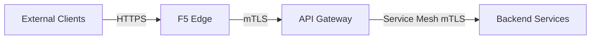
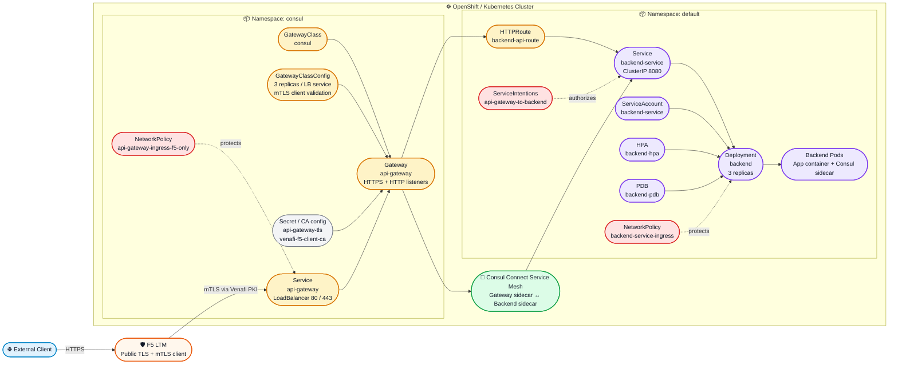
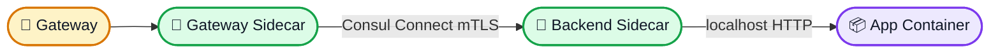
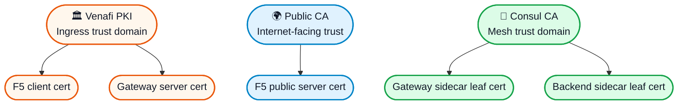
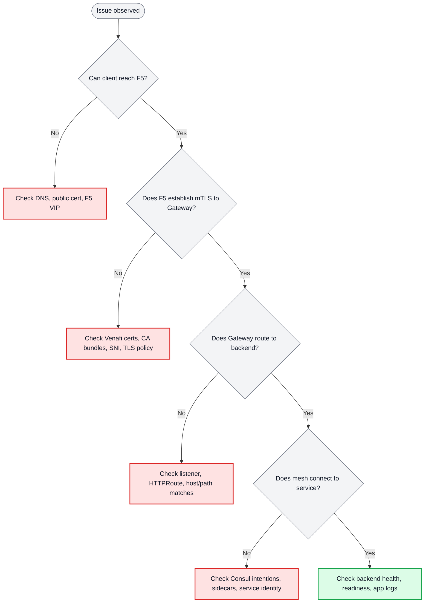

# API Gateway mTLS Architecture

## Executive Overview

### Executive Summary

- **Clients connect securely** over standard HTTPS.
- **F5 authenticates to the API Gateway** using **mutual TLS (mTLS)**.
- **Internal service-to-service traffic** is protected separately by the **Consul service mesh**.
- **Application teams do not manage edge TLS directly**.

## At a Glance

```mermaid
flowchart LR
    client([🌐 External Client<br/>Browser / Mobile / API Client])
    f5([🛡️ F5 Load Balancer<br/>Public TLS termination<br/>WAF / inspection])

    subgraph cluster[☸️ OpenShift / Kubernetes Cluster]
        direction LR
        gateway([🚪 Consul API Gateway<br/>Venafi server cert<br/>Validates F5 client cert])
        mesh([🔐 Consul Connect Service Mesh<br/>Automatic workload mTLS])
        backend([📦 Backend Service<br/>Plain HTTP only inside pod])
    end

    client -->|HTTPS<br/>Public CA| f5
    f5 -->|mTLS<br/>Venafi PKI<br/>Primary security boundary| gateway
    gateway -->|mTLS<br/>Consul CA| mesh
    mesh -->|localhost HTTP| backend

    classDef edge fill:#e8f1ff,stroke:#1d4ed8,stroke-width:2px,color:#111827;
    classDef ingress fill:#fff7ed,stroke:#ea580c,stroke-width:2px,color:#111827;
    classDef meshClass fill:#ecfdf5,stroke:#059669,stroke-width:2px,color:#111827;
    classDef app fill:#f5f3ff,stroke:#7c3aed,stroke-width:2px,color:#111827;

    class client edge;
    class f5 ingress;
    class gateway ingress;
    class mesh meshClass;
    class backend app;
```

### Diagram Legend

- **Blue**: external client entry point
- **Orange**: edge ingress and primary mTLS trust boundary
- **Green**: internal service mesh trust domain
- **Purple**: application workload

## Kubernetes Deployment View

This one-page view focuses on the **Kubernetes resources deployed in this repository** and how they relate to each other, while still showing the **F5 LTM** and **backend service** in the end-to-end path.

### How to Read This Diagram

- **F5 LTM** is external to the cluster and connects to the Kubernetes-hosted API Gateway over **mTLS**.
- In the **`consul` namespace**, the repo defines the **Gateway API control and ingress resources**:
  - `GatewayClass`
  - `GatewayClassConfig`
  - `Gateway`
  - `Service` for the gateway
  - TLS materials for server certificate and client CA validation
  - Gateway-specific `NetworkPolicy`
- In the **`default` namespace**, the repo defines the **application-facing resources**:
  - `HTTPRoute`
  - `ServiceIntentions`
  - `backend-service` `Service`
  - `backend` `Deployment`
  - `ServiceAccount`
  - `HorizontalPodAutoscaler`
  - `PodDisruptionBudget`
  - backend `NetworkPolicy`
- **Consul Connect mTLS** protects gateway-to-backend communication inside the cluster.

### Resource Relationship Summary

| Resource | Role | Relationship |
|---|---|---|
| `GatewayClass` | Declares Consul as the Gateway API controller | Referenced by `Gateway` |
| `GatewayClassConfig` | Configures gateway deployment/service/TLS behavior | Attached to `GatewayClass` |
| `Gateway` | Defines listeners and ingress TLS/mTLS settings | Front door inside Kubernetes |
| `api-gateway` Service | Exposes gateway listeners on ports 80/443 | Target for F5 connection |
| `api-gateway-tls` / `venafi-f5-client-ca` | Server cert and trusted client CA material | Used by gateway TLS validation |
| `HTTPRoute` | Maps incoming paths/hosts to backend service | Attached to `Gateway` |
| `ServiceIntentions` | Authorizes gateway to call backend over mesh | Applies between gateway and backend |
| `backend-service` Service | Stable in-cluster endpoint for backend pods | Referenced by route |
| `backend` Deployment | Runs application replicas | Backed by Consul sidecar injection |
| `ServiceAccount` | Workload identity for backend pods | Used by deployment |
| `HPA` | Scales backend deployment | Targets `backend` |
| `PDB` | Protects backend availability during disruption | Targets backend pods |
| `NetworkPolicy` | Restricts ingress/egress paths | Protects gateway and backend workloads |

## Why This Architecture Exists

This architecture separates external ingress security from internal service-to-service security:

- **External Client → F5** uses standard HTTPS with a public CA certificate.
- **F5 → API Gateway** uses **mutual TLS (mTLS)** with **Venafi-issued certificates**.
- **API Gateway → Backend Service** uses **Consul Connect mTLS** with **Consul-issued identities**.
- **Backend applications** stay simple by receiving plain HTTP only from their local sidecar.

## End-to-End Reference Architecture

```mermaid
flowchart LR
    %% Entry
    client([🌐 External Client<br/>Browser / Mobile / API Consumer])
    dns([🧭 DNS<br/>api.example.com])

    %% Edge
    subgraph edge[🛡️ Edge / DMZ]
        direction TB
        f5in([F5 Virtual Server<br/>Inbound TLS / Public CA])
        waf([WAF / Inspection / Policy])
        f5out([F5 Server SSL Profile<br/>mTLS client to Gateway<br/>Venafi client cert])
    end

    %% Cluster
    subgraph cluster[☸️ OpenShift / Kubernetes Cluster]
        direction LR

        subgraph ingress[🚪 Ingress Layer]
            direction TB
            gwsvc([Gateway Service<br/>LoadBalancer / NodePort])
            gateway([Consul API Gateway<br/>HTTPS Listener<br/>Venafi server cert])
            routes([HTTPRoute Rules<br/>Path / Header / Split])
        end

        subgraph mesh[🔐 Consul Connect Mesh]
            direction TB
            gwsidecar([Gateway Envoy Sidecar<br/>Consul identity])
            meshmtls([Service Mesh mTLS<br/>Consul CA])
            beSidecar([Backend Envoy Sidecar<br/>Consul identity])
        end

        subgraph app[📦 Application Layer]
            direction TB
            backend([Backend Service<br/>ClusterIP])
            pod([App Container<br/>localhost HTTP only])
            health([Health / Ready Endpoints])
        end
    end

    %% Flow
    client -->|1. HTTPS| dns
    dns -->|2. Resolve / Route| f5in
    f5in --> waf
    waf -->|3. Inspect / enforce| f5out
    f5out -->|4. mTLS via Venafi PKI| gwsvc
    gwsvc --> gateway
    gateway --> routes
    routes -->|5. Route selected request| gwsidecar
    gwsidecar -->|6. Consul Connect mTLS| meshmtls
    meshmtls --> beSidecar
    beSidecar -->|7. localhost HTTP| backend
    backend --> pod
    pod --> health

    %% Response flow hints
    pod -.->|8. Response| beSidecar
    beSidecar -.->|9. Mesh return path| gwsidecar
    gwsidecar -.->|10. Gateway response| gateway
    gateway -.->|11. F5 return path| f5out
    f5out -.->|12. HTTPS response| client

    %% Styles
    classDef external fill:#e0f2fe,stroke:#0284c7,stroke-width:2px,color:#0f172a;
    classDef edgeClass fill:#fff7ed,stroke:#ea580c,stroke-width:2px,color:#111827;
    classDef ingressClass fill:#fef3c7,stroke:#d97706,stroke-width:2px,color:#111827;
    classDef meshClass fill:#dcfce7,stroke:#16a34a,stroke-width:2px,color:#111827;
    classDef appClass fill:#ede9fe,stroke:#7c3aed,stroke-width:2px,color:#111827;
    classDef aux fill:#f3f4f6,stroke:#6b7280,stroke-width:1px,color:#111827;

    class client,dns external;
    class f5in,waf,f5out edgeClass;
    class gwsvc,gateway,routes ingressClass;
    class gwsidecar,meshmtls,beSidecar meshClass;
    class backend,pod appClass;
    class health aux;
```

## Trust Boundaries

| Boundary | Connection | TLS Mode | Trust Source | Purpose |
|---|---|---|---|---|
| 1 | External Client → F5 | HTTPS | Public CA | Secure public ingress |
| 2 | F5 → API Gateway | mTLS | Venafi PKI | Authenticated north-south traffic |
| 3 | API Gateway → Backend | mTLS | Consul CA | Service-to-service encryption |

> [!IMPORTANT]
> The primary security boundary is **F5 → API Gateway**. This is where mutual authentication is enforced using Venafi-issued certificates.

## Zoom-In by Layer

### 1. Edge Ingress and Public TLS

Key points:
- Public clients connect to `api.example.com` over HTTPS.
- F5 terminates public TLS and can apply WAF, inspection, or rate limiting.
- This layer protects the public edge but is **not** the primary mutual-authentication boundary.

### 2. Primary Security Boundary: F5 → API Gateway mTLS

Key points:
- F5 acts as the **TLS client** when connecting to the API Gateway.
- The API Gateway presents a **Venafi-issued server certificate**.
- F5 presents a **Venafi-issued client certificate**.
- Both sides validate identity before traffic is allowed.

### 3. Internal East-West Service Mesh

Key points:
- Internal traffic uses **Consul Connect mTLS**, not Venafi ingress certificates.
- Sidecars handle encryption and identity automatically.
- The application container can remain plain HTTP internally.

## Request Flow

1. **Client request**  
   A client sends `HTTPS` traffic to `api.example.com` using a certificate trusted by a public CA.

2. **F5 processing**  
   F5 terminates external TLS, performs inspection or policy enforcement, and opens a new **mTLS** connection to the API Gateway.

3. **Gateway authentication and routing**  
   The API Gateway validates the F5 client certificate, applies `HTTPRoute` rules, and forwards traffic toward the backend service.

4. **Service mesh transport**  
   Consul Connect sidecars establish **mTLS** between the gateway and backend service.

5. **Backend handling**  
   The backend sidecar forwards plain HTTP to the local application container.

6. **Response path**  
   The response returns over the same layers in reverse: backend mesh → gateway → F5 → external client.

## Step-by-Step Reference Table

| Step | From | To | Protocol | Identity / Certificate | What Happens |
|---|---|---|---|---|---|
| 1 | Client | DNS / F5 | HTTPS | Public CA | Client resolves and initiates secure connection |
| 2 | F5 inbound | F5 processing | TLS terminated | Public server cert on F5 | Edge TLS is terminated and inspected |
| 3 | F5 outbound | API Gateway service | mTLS | F5 client cert + Gateway server cert | Mutual authentication enforced |
| 4 | API Gateway | Route engine | HTTPS request context | Gateway listener policy | Path/header routing decision made |
| 5 | Gateway sidecar | Backend sidecar | mTLS | Consul identities | Mesh encryption and authorization |
| 6 | Backend sidecar | App container | HTTP | localhost only | Plain HTTP delivered internally |
| 7 | App | Return path | Reverse of above | Same trust layers | Response returns to caller |

## Core Components

### External Client
- Web browser, mobile app, or API client
- Connects to `api.example.com`
- Uses standard HTTPS
- May optionally present a client certificate if required by edge policy

### F5 Load Balancer
- Terminates public TLS
- Presents the public-facing server certificate
- Applies inspection, WAF, rate limiting, or other edge controls
- Presents an **F5 client certificate** to the API Gateway
- Validates the API Gateway server certificate
- Forwards traffic only to healthy API Gateway pool members

### Consul API Gateway
- Exposes HTTPS listener for inbound traffic from F5
- Presents a **Venafi-issued server certificate**
- Requires and validates the F5 client certificate
- Applies `HTTPRoute` path and header rules
- Uses Consul Connect sidecar for service mesh communication

### Consul Service Mesh
- Establishes automatic mTLS between workloads
- Issues short-lived workload identities
- Enforces service intentions and authorization rules
- Keeps service-to-service encryption separate from ingress PKI

### Backend Service
- Receives traffic through a Consul sidecar
- Benefits from mesh identity and authorization controls
- Receives plain HTTP from `localhost` sidecar traffic only
- Does not need to manage external TLS directly

## Certificate Model

The environment uses **two separate PKI domains**:

1. **Venafi PKI** for ingress trust between F5 and API Gateway
2. **Consul PKI** for east-west service mesh trust

### PKI Relationship Map

### Venafi PKI: Edge Ingress Trust

| Certificate | Used By | Purpose | Rotation / Lifetime | Storage |
|---|---|---|---|---|
| Public server certificate | F5 | External HTTPS for `api.example.com` | Per public CA policy | F5 certificate store |
| F5 client certificate | F5 | Authenticate F5 to API Gateway | Rotated before expiry | F5 certificate store |
| API Gateway server certificate | API Gateway | Authenticate API Gateway to F5 | Rotated before expiry | Kubernetes Secret |

Typical validation on this boundary includes:

- Client certificate required
- Hostname verification enabled
- SAN / identity matching enforced
- TLS 1.2+ only
- Strong cipher suites only

### Consul PKI: Service Mesh Trust

| Certificate | Used By | Purpose | Rotation / Lifetime | Storage |
|---|---|---|---|---|
| Gateway sidecar certificate | API Gateway sidecar | Mesh identity | Short-lived / automatic | Envoy memory |
| Backend sidecar certificate | Backend sidecar | Mesh identity | Short-lived / automatic | Envoy memory |

This PKI domain is intentionally separate from the Venafi ingress PKI.

## Policy and Routing Summary

### Network policy
- Restrict ingress to trusted F5 source IP ranges only
- Allow egress only to required backend services and Consul components
- Deny other traffic by default

### Gateway routing
- Path-based routing such as `/api/v1/* → backend-service`
- Header mutation such as `X-Forwarded-Proto` or `X-Gateway`
- Optional traffic splitting for canary releases
- Optional rate limiting and edge policy enforcement

### Service intentions
- Explicitly allow `api-gateway → backend-service`
- Restrict paths and methods where needed
- Deny all unspecified sources by default

## Operational Views

### Failure domain map

| Layer | Typical Failure | Symptom | First Check |
|---|---|---|---|
| Public ingress | DNS / public cert / VIP issue | Client cannot connect | DNS, F5 VIP, public cert |
| Edge mTLS | Client/server cert validation failure | 4xx/5xx or TLS handshake failure between F5 and Gateway | Venafi certs, CA bundles, SNI |
| Gateway routing | Route mismatch / listener issue | Request reaches gateway but not backend | Listener, HTTPRoute, host/path rules |
| Mesh transport | Sidecar / intention / service identity issue | Upstream connect failure | Consul intentions, sidecars, mesh certs |
| App workload | Backend unhealthy | 503 / failed readiness / timeout | Pod health, app logs, service endpoints |

### Quick troubleshooting path

## Observability

### F5
- TLS handshake metrics
- Client-side and server-side connection counts
- Certificate expiration monitoring
- Virtual server and pool health

### API Gateway / Envoy
- TLS handshake failures
- Upstream TLS connection totals
- Request duration and latency metrics
- Certificate expiration metrics

### Consul Service Mesh
- Leaf certificate expiry metrics
- Service-to-service request totals
- Intention allow / deny counters

## Operational Notes

> [!NOTE]
> The backend application does **not** terminate TLS directly. TLS is terminated or enforced by infrastructure layers: F5 at the edge, API Gateway for ingress mTLS, and Consul sidecars for service mesh mTLS.

> [!TIP]
> When debugging connectivity, check the failing boundary first:
>
> - **External connectivity issues** → F5 public TLS and DNS
> - **Ingress authentication issues** → F5 ↔ API Gateway Venafi mTLS
> - **Backend communication issues** → Consul Connect mTLS and intentions

Implementation details preserved from the original design

### F5 to API Gateway boundary
- F5 acts as the client when connecting to the API Gateway
- API Gateway acts as the server on the ingress mTLS boundary
- F5 validates the API Gateway certificate against the Venafi CA bundle
- API Gateway validates the F5 client certificate against the trusted Venafi client CA bundle
- SNI and hostname verification should remain enabled where supported

### API Gateway service shape
- Service may be exposed using `LoadBalancer` or `NodePort` patterns depending on platform requirements
- HTTPS listener commonly maps `443 → 8443`
- Optional HTTP redirect listener commonly maps `80 → 8080`

### Backend service shape
- Backend service is typically exposed internally as `ClusterIP`
- Application container commonly listens on port `8080`
- Health endpoints may include `/health` and `/ready`

