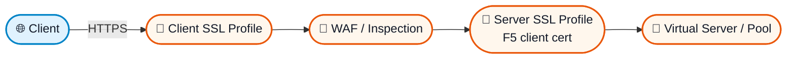
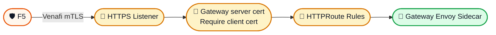
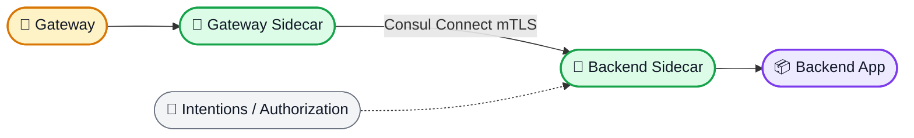
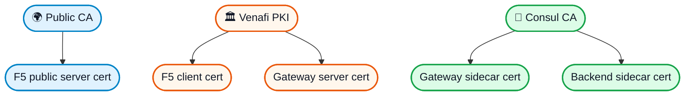
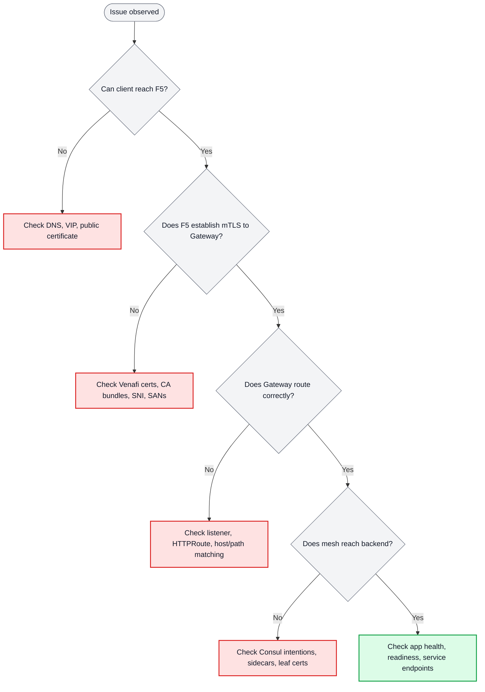

# Architecture: F5 LTM to Consul API Gateway mTLS

## Executive Overview

This document provides a comprehensive reference for how traffic flows from external clients, through F5, into Consul API Gateway, and onward to backend services protected by the Consul service mesh.


### Executive Summary

- **External clients** connect over standard HTTPS using a public CA certificate.
- **F5** terminates public TLS and becomes the authenticated client to the API Gateway.
- **F5 → API Gateway** is the primary **mutual TLS (mTLS)** trust boundary using **Venafi-issued certificates**.
- **API Gateway → backend services** is protected separately using **Consul Connect mTLS**.
- **Applications stay simple** because backend containers receive plain HTTP only from the local sidecar.

## At a Glance

```mermaid
flowchart LR
    client([🌐 External Client<br/>Browser / Mobile / API Consumer])
    dns([🧭 DNS<br/>api.example.com])

    subgraph edge[🛡️ Edge / DMZ]
        direction TB
        f5in([F5 Virtual Server<br/>Public TLS termination])
        waf([WAF / Inspection / Policy])
        f5out([F5 Server SSL Profile<br/>mTLS client identity])
    end

    subgraph cluster[☸️ OpenShift / Kubernetes Cluster]
        direction LR

        subgraph ingress[🚪 Ingress Layer]
            direction TB
            gwsvc([Gateway Service<br/>LoadBalancer / NodePort])
            gateway([Consul API Gateway<br/>Venafi server cert])
            routes([HTTPRoute Rules<br/>Path / Header / Split])
        end

        subgraph mesh[🔐 Consul Connect Mesh]
            direction TB
            gwsidecar([Gateway Envoy Sidecar])
            meshmtls([Mesh mTLS<br/>Consul CA])
            beSidecar([Backend Envoy Sidecar])
        end

        subgraph app[📦 Application Layer]
            direction TB
            backend([Backend Service<br/>ClusterIP])
            pod([Application Container<br/>localhost HTTP only])
        end
    end

    client -->|1. HTTPS| dns
    dns -->|2. Resolve| f5in
    f5in --> waf
    waf -->|3. Inspect / enforce| f5out
    f5out -->|4. Venafi mTLS| gwsvc
    gwsvc --> gateway
    gateway --> routes
    routes -->|5. Forward| gwsidecar
    gwsidecar -->|6. Consul mTLS| meshmtls
    meshmtls --> beSidecar
    beSidecar -->|7. localhost HTTP| backend
    backend --> pod

    classDef blue fill:#e0f2fe,stroke:#0284c7,stroke-width:2px,color:#111827;
    classDef orange fill:#fff7ed,stroke:#ea580c,stroke-width:2px,color:#111827;
    classDef amber fill:#fef3c7,stroke:#d97706,stroke-width:2px,color:#111827;
    classDef green fill:#dcfce7,stroke:#16a34a,stroke-width:2px,color:#111827;
    classDef purple fill:#ede9fe,stroke:#7c3aed,stroke-width:2px,color:#111827;

    class client,dns blue;
    class f5in,waf,f5out orange;
    class gwsvc,gateway,routes amber;
    class gwsidecar,meshmtls,beSidecar green;
    class backend,pod purple;
```



### Diagram Legend

- **Blue**: external client and name resolution
- **Orange**: edge / DMZ ingress controls
- **Amber**: ingress gateway and routing layer
- **Green**: internal service mesh trust domain
- **Purple**: application workload and service destination

## Why This Architecture Exists

This architecture intentionally separates **north-south ingress security** from **east-west service mesh security**:

- **External Client → F5** uses standard HTTPS with a public CA.
- **F5 → API Gateway** uses **Venafi-backed mTLS** for authenticated ingress.
- **API Gateway → Backend Service** uses **Consul Connect mTLS** for internal workload identity.
- **Applications** do not manage public TLS or ingress mutual-authentication details directly.

## Trust Boundaries

| Boundary | Connection | TLS Mode | Trust Source | Purpose |
|---|---|---|---|---|
| 1 | External Client → F5 | HTTPS | Public CA | Secure public ingress |
| 2 | F5 → API Gateway | mTLS | Venafi PKI | Authenticated north-south traffic |
| 3 | API Gateway → Backend | mTLS | Consul CA | Service-to-service encryption |

> [!IMPORTANT]
> The most important boundary in this design is **F5 → API Gateway**. This is the ingress mTLS control point where mutual certificate validation is enforced.

## End-to-End Traffic Flow

### Step 1: External Client Request

```text
Client → F5 LTM
- Client initiates HTTPS connection
- F5 presents public CA-signed certificate
- Optional: client certificate validation at edge
- Traffic is decrypted for inspection or policy enforcement
```

### Step 2: F5 to API Gateway mTLS

```text
F5 → API Gateway
- F5 initiates new TLS connection
- F5 presents Venafi-issued client certificate
- API Gateway presents Venafi-issued server certificate
- Both sides validate against trusted Venafi CA bundles
- SNI and hostname verification remain enabled
```

### Step 3: API Gateway to Backend Service

```text
API Gateway → Backend Service
- HTTPRoute selects target service
- Gateway sidecar establishes Consul Connect mTLS
- Backend sidecar receives decrypted traffic
- Local sidecar forwards plain HTTP to application container
```

## Request Flow Reference Table

| Step | From | To | Protocol | Identity / Certificate | Description |
|---|---|---|---|---|---|
| 1 | Client | F5 | HTTPS | Public CA | Secure public connection begins |
| 2 | F5 inbound | F5 processing | TLS terminated | F5 public cert | Edge security controls applied |
| 3 | F5 outbound | API Gateway | mTLS | F5 client cert + Gateway server cert | Mutual authentication enforced |
| 4 | API Gateway | HTTPRoute engine | HTTPS request context | Listener and route policy | Request routing decision |
| 5 | Gateway sidecar | Backend sidecar | mTLS | Consul-issued identities | East-west service security |
| 6 | Backend sidecar | App container | HTTP | localhost only | Application receives request |
| 7 | App container | Client | Reverse path | Same layered trust controls | Response returns |

## Architecture Deep Dive

### Edge Layer: F5 LTM



#### Client SSL Profile (Inbound)
```text
Purpose: Terminate external client TLS
Certificate: Public CA certificate
Key: Private key for public certificate
Client Auth: Optional
```

#### Server SSL Profile (Outbound)
```text
Purpose: mTLS to API Gateway
Client Certificate: F5 identity (Venafi)
Client Key: F5 private key
Server CA Bundle: Venafi CA for Gateway validation
Peer Cert Mode: Require
SNI: api-gateway.consul.svc.cluster.local
```

#### Virtual Server
```text
Frontend: External IP:443
Backend Pool: API Gateway endpoints
Client Profile: external-client-ssl
Server Profile: f5-to-consul-gateway
```

### Ingress Layer: Consul API Gateway



#### Gateway Resource
```yaml
Listener:
  - Port: 443
  - Protocol: HTTPS
  - TLS Mode: Terminate
  - Server Certificate: Venafi-issued
  - Client Certificate: Required
  - Client CA: Venafi CA bundle
```

#### TLS Configuration
```text
Server Certificate: api-gateway-tls secret
Client Validation: venafi-f5-client-ca ConfigMap
Require Client Cert: true
TLS Min Version: 1.2
Cipher Suites: Strong ciphers only
```

### Service Mesh Layer: Consul Connect



Key responsibilities:
- Automatic mTLS between workloads
- Short-lived workload certificates
- Authorization through Consul intentions
- Clear separation from ingress PKI

## Certificate Strategy

The environment uses **two separate PKI hierarchies**.

### PKI Relationship Map



### Venafi PKI (Edge Ingress)

```text
Venafi Root CA
└── Venafi Intermediate CA (Ingress)
    ├── API Gateway Server Certificate
    │   CN: api-gateway.consul.svc.cluster.local
    │   SAN: api-gateway.example.com, *.api.example.com
    └── F5 Client Certificate
        CN: f5-load-balancer.example.com
        SAN: f5-lb-01.example.com, 10.0.1.10
```

### Consul PKI (Service Mesh)

```text
Consul Root CA
└── Consul Intermediate CA
    ├── API Gateway Sidecar Certificate (auto-issued)
    └── Backend Service Certificates (auto-issued)
```

### Why Separate PKI?

1. **Security isolation** between ingress and east-west traffic
2. **Different rotation policies** for edge certificates vs. workload identities
3. **Minimal trust scope** for each domain
4. **Operational clarity** for ownership and troubleshooting

## OpenShift Networking and Exposure Patterns

### Service Exposure Options

**Option A: Direct Exposure (Recommended)**
```yaml
Service Type: LoadBalancer or NodePort
Direct connection from F5 to Gateway pods
No intermediate TLS termination
Preserves mTLS end-to-end
```

**Option B: Passthrough Route**
```yaml
Route Type: Passthrough
No TLS termination at router
F5 connects through OpenShift router
mTLS preserved
```

## Security Controls

### Network Layer
- NetworkPolicy restricts access to trusted F5 source IPs only
- Service mesh access control through Consul intentions
- Pod security standards and namespace isolation

### Certificate Layer
- Short-lived certificates where possible
- Automated rotation via Venafi and Consul
- Strict peer validation
- SAN and subject constraints enforced

### Application Layer
- HTTP path and method restrictions
- Rate limiting at F5 or Gateway
- Explicit route ownership and service authorization

## High Availability

### F5 LTM
- Active-Active or Active-Standby deployment
- Shared virtual server configuration
- Certificate synchronization between appliances

### Consul API Gateway
- Multiple replicas recommended (3+)
- Pod anti-affinity
- Readiness and liveness probes

### Backend Services
- Multiple replicas per workload
- Consul health checking
- Automatic failover through service discovery and mesh routing

## Monitoring and Observability

### Metrics Collection

```text
F5 → Prometheus
- SSL handshake stats
- Connection counts
- Certificate expiration

API Gateway → Prometheus
- Envoy metrics
- Request rates
- TLS handshake failures

Service Mesh → Prometheus
- Service-to-service metrics
- mTLS connection stats
- Intention denials
```

### Logging

```text
F5 → Syslog / Splunk
- Access logs
- SSL handshake events
- Certificate validation failures

API Gateway → OpenShift Logging
- Request logs
- TLS errors
- Client certificate details

Service Mesh → Consul / Envoy Logs
- Connection events
- Authorization decisions
```

### Alerting

```text
Certificate Expiration < 15 days
TLS Handshake Failure Rate > threshold
Connection Refused errors
Certificate validation failures
```

## Failure Domains and Troubleshooting

### Failure Domain Map

| Layer | Typical Failure | Symptom | First Check |
|---|---|---|---|
| Public ingress | DNS, VIP, public cert issue | Client cannot connect | DNS record, VIP, public cert |
| Edge mTLS | Venafi trust or client/server cert mismatch | TLS handshake failure | CA bundles, SNI, SANs, cert validity |
| Gateway routing | Listener or route mismatch | Request reaches gateway but does not forward | Listener config, host/path rules |
| Mesh transport | Consul identity or intention denial | Upstream connect / authorization failure | Sidecars, intentions, service identities |
| App workload | Unhealthy pod or timeout | 503, readiness failure, timeout | Pod health, service endpoints, logs |

### Quick Troubleshooting Path



## Disaster Recovery

### Certificate Loss
1. Request replacement certificates from Venafi
2. Update F5 configuration
3. Update Kubernetes Secrets or ConfigMaps
4. Restart or roll Gateway workloads if required

### F5 Failure
1. Fail over to standby F5 appliance
2. Confirm certificate synchronization
3. Verify API Gateway pool health

### API Gateway Failure
1. Kubernetes recreates pods automatically
2. Certificates remount from Secrets
3. F5 health checks route around failed instances

### Venafi Outage
1. Existing certificates continue working until expiry
2. Rotation is delayed
3. Monitor certificate expiration closely

## Compliance and Audit

### Certificate Audit Trail
- Venafi logs certificate issuance and renewal
- Kubernetes audit logs track Secret access
- F5 logs certificate usage and TLS negotiation

### Access Audit
- F5 logs inbound client connections
- API Gateway logs routed requests
- Consul logs service-to-service authorization outcomes

### Compliance Requirements
- TLS 1.2+ only
- Strong cipher suites only
- Certificate rotation under organizational policy
- Mutual authentication enforced at ingress
- Network segmentation and least privilege

## Performance Considerations

### TLS Overhead
- F5 can offload public TLS efficiently
- Envoy handles mesh TLS efficiently
- Connection reuse reduces repeated handshake cost

### Certificate Validation
- Revocation strategies may include OCSP or CRL where required
- Validation result caching may improve performance
- Short-lived leaf certificates reduce risk exposure

### Example Latency Impact

```text
External Client → F5: ~5-10ms (TLS handshake)
F5 → API Gateway: ~5-10ms (mTLS handshake)
API Gateway → Backend: ~1-2ms (mesh mTLS)
Total TLS overhead: ~15-25ms
```

## Future Enhancements

### Short-Term
- Automated F5 certificate rotation workflows
- Better observability dashboards
- Conformance testing for mTLS validation paths

### Long-Term
- SPIFFE / SPIRE integration
- Hardware security module (HSM) support
- Multi-region deployment patterns
- Broader zero-trust network controls

## References

- [Consul API Gateway Documentation](https://developer.hashicorp.com/consul/docs/api-gateway)
- [Venafi Trust Protection Platform](https://docs.venafi.com/)
- [F5 SSL Profile Reference](https://techdocs.f5.com/en-us/bigip-15-0-0/big-ip-local-traffic-manager-profiles-reference/ssl-profile.html)
- [Kubernetes Gateway API](https://gateway-api.sigs.k8s.io/)
- [Envoy TLS Configuration](https://www.envoyproxy.io/docs/envoy/latest/intro/arch_overview/security/ssl)
